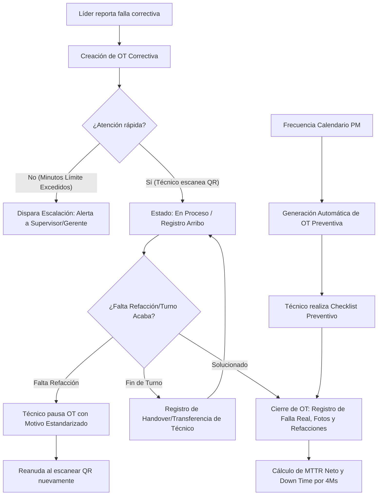
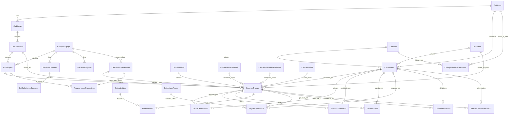

# Especificación Técnica y Diseño de Base de Datos para Sistema CMMS (Versión Industrial)
**Enfoque**: Mantenimiento a Equipos de Manufactura, Órdenes de Trabajo (OT), Mantenimiento Preventivo (PM), Control de Down Time y Matriz de Escalación.
**Motor de Base de Datos**: SQL Server 2017 (versión 14.0)

---

## 1. Arquitectura de Negocio y Flujo de Trabajo

El sistema está diseñado para operar en una planta de manufactura estructurada por Áreas, Líneas, Estaciones y Equipos. Permite la interacción ágil entre Líderes de Línea y Técnicos a través de dispositivos móviles/tablets con escaneo de códigos QR.

### Registro Inicial del Líder (Análisis de Paros / Down Time)
Para medir adecuadamente el tiempo perdido y alimentar reportes de eficiencia, el líder de línea no solo escribe un comentario abierto al reportar la falla de una estación. Ahora captura campos estructurados que facilitan el análisis de causas raíz y costos de paro:
1.  **Síntoma de Falla**: Selección de una lista estandarizada de lo que observa (ej. "Robot no cicla", "PC no enciende", "Fuga de aire").
2.  **Causa de las 4Ms**: Clasificación inicial bajo los pilares de manufactura: *Mano de Obra (Manpower)*, *Maquinaria (Machine)*, *Material (Material)* o *Método (Method)*.
3.  **Clasificación de Falla**: Selección estructurada (Calidad, Falta de Material, Operación, Problema de Partes/Componentes, Otros).
4.  **Impacto**: Área o nivel de afectación (Línea Completa detenida, Estación Cuello de Botella detenida, Estación Regular detenida).
5.  **Empleados Afectados**: Cantidad de operadores detenidos o reasignados temporalmente debido al paro en la estación.

---

### Flujos Operativos Críticos Integrados

#### A. Gestión de Pausas Estandarizadas (MTTR Real)
Cuando un técnico se encuentra detenido por causas ajenas a su control (ej. espera de una refacción ausente en el almacén o soporte de un proveedor), puede pausar la OT seleccionando un motivo estandarizado. El sistema registra las marcas de tiempo exactas para descontar estos periodos y calcular un **MTTR (Tiempo Medio de Reparación) Neto**, reflejando la eficiencia real del departamento.

#### B. Mantenimiento Preventivo Planificado (PM)
El sistema genera automáticamente órdenes de trabajo preventivas (`TipoMantenimiento = 'PREVENTIVO'`) basadas en rutinas por calendario (días transcurridos). Los técnicos atienden estas tareas mediante checklists digitales y herramientas de soporte vinculadas al tipo de equipo.

#### C. Matriz de Escalación de Alertas
Si una orden correctiva catalogada con alto impacto (ej. *Línea Completa detenida*) permanece en estado "Creada" o "En Proceso" sin arribar el QR por un lapso superior a los minutos configurados, el sistema activa una escalación automática a través de la base de datos para alertar a Supervisores o Gerentes de Planta.

#### D. Transferencia de Turno (Handover)
En operaciones continuas de 24 horas, si una reparación compleja no concluye antes del fin del turno, la OT puede ser transferida formalmente a los técnicos entrantes. El sistema cierra las métricas de tiempo del técnico saliente e inicia la del entrante bajo una bitácora que resguarda notas de entrega.



---

## 2. Diagrama de Entidad-Relación (Mermaid)

El siguiente modelo lógico-relacional incorpora de manera normalizada todos los módulos e interacciones requeridas.



---

## 3. Diccionario de Datos

Cada tabla del sistema cuenta de forma obligatoria con los campos comunes:
*   `activo BIT DEFAULT 1`
*   `fecharegistro DATETIME DEFAULT GETDATE()`

---

### Módulo 1: Gestión de Pausas Estandarizadas

#### 1. `CatMotivosPausa`
Catálogo de razones por las que se puede detener la labor de mantenimiento en una OT.
*   `ID` (INT, PK, Identity)
*   `Nombre` (VARCHAR(100)): Ej. "Espera de Refacción", "Espera de Soporte Externo", "Espera de Calidad", "Fin de Turno".
*   `Descripcion` (VARCHAR(250))

#### 2. `RegistroPausasOT`
Registro transaccional de marcas de tiempo de las pausas para calcular MTTR Neto.
*   `ID` (INT, PK, Identity)
*   `OrdenTrabajoID` (INT, FK -> OrdenesTrabajo.ID)
*   `MotivoPausaID` (INT, FK -> CatMotivosPausa.ID)
*   `UsuarioPausaID` (INT, FK -> CatUsuarios.ID): Técnico que activó la pausa.
*   `FechaInicioPausa` (DATETIME): Fecha y hora en la que se pausa.
*   `FechaFinPausa` (DATETIME, Nullable): Fecha y hora en la que se reanuda la labor.
*   `Comentario` (VARCHAR(500)): Nota explicativa.

---

### Módulo 2: Mantenimiento Preventivo (PM) y Planificado

#### 3. `CatRutinasPreventivas`
Actividades de prevención asociadas a un tipo de equipo específico.
*   `ID` (INT, PK, Identity)
*   `TipoEquipoID` (INT, FK -> CatTiposEquipo.ID)
*   `Nombre` (VARCHAR(150)): Ej. "Limpieza de Ventiladores y Filtros", "Calibración Semestral de Celda".
*   `Descripcion` (VARCHAR(1000))
*   `FrecuenciaDias` (INT): Frecuencia recomendada en días calendario (ej. 30 para mensual, 180 para semestral).

#### 4. `ProgramacionPreventivos`
Agenda de ejecución por equipo individual.
*   `ID` (INT, PK, Identity)
*   `EquipoID` (INT, FK -> CatEquipos.ID)
*   `RutinaPreventivaID` (INT, FK -> CatRutinasPreventivas.ID)
*   `FechaUltimaEjecucion` (DATETIME, Nullable)
*   `FechaProximaEjecucion` (DATETIME): Fecha calculada para el siguiente servicio.

---

### Módulo 3: Matriz de Escalación de Paros

#### 5. `ConfiguracionEscalaciones`
Define reglas de tiempo de respuesta basadas en el área y el impacto del paro.
*   `ID` (INT, PK, Identity)
*   `AreaID` (INT, FK -> CatAreas.ID): Área aplicable (SMT, Ensamble, etc.).
*   `ImpactoAfectacion` (VARCHAR(150)): Ej. "LINEA_COMPLETA", "ESTACION_CUELLO_BOTELLA".
*   `TiempoLimiteMinutos` (INT): Tiempo máximo tolerado sin arribar del técnico.
*   `RolNotificarID` (INT, FK -> CatRoles.ID): Rol de usuario a alertar (ej. Supervisor, Superintendente).

#### 6. `ColaNotificaciones`
Registro histórico y cola de despacho de alertas.
*   `ID` (INT, PK, Identity)
*   `OrdenTrabajoID` (INT, FK -> OrdenesTrabajo.ID)
*   `NivelEscalacion` (INT): Nivel de alerta alcanzado (1, 2, 3, etc.).
*   `Mensaje` (VARCHAR(500))
*   `DestinatarioUsuarioID` (INT, FK -> CatUsuarios.ID): Usuario específico al que va dirigida la alerta.
*   `FechaEnvio` (DATETIME, Nullable): Registro de cuándo fue despachada la alerta (Push, Email, etc.).
*   `Enviado` (BIT DEFAULT 0)

---

### Módulo 4: Transferencia de Turno (Handover)

#### 7. `BitacoraTransferenciasOT`
Control detallado del traspaso de órdenes de trabajo activas entre turnos.
*   `ID` (INT, PK, Identity)
*   `OrdenTrabajoID` (INT, FK -> OrdenesTrabajo.ID)
*   `TecnicoSalienteID` (INT, FK -> CatUsuarios.ID): Técnico que entrega la orden.
*   `TecnicoEntranteID` (INT, FK -> CatUsuarios.ID): Técnico que recibe la orden en el nuevo turno.
*   `ComentarioHandover` (VARCHAR(1000)): Notas detallando qué pruebas se realizaron y qué falta concluir.
*   `FechaTransferencia` (DATETIME): Fecha y hora del traspaso.

---

### Módulos de Catálogos de Planta y Activos

#### 8. `CatTurnos`
*   `ID` (INT, PK, Identity), `Nombre` (VARCHAR(50)), `HoraInicio` (TIME), `HoraFin` (TIME).

#### 9. `CatAreas`
*   `ID` (INT, PK, Identity), `Nombre` (VARCHAR(100)), `Descripcion` (VARCHAR(250)).

#### 10. `CatLineas`
*   `ID` (INT, PK, Identity), `AreaID` (INT, FK -> CatAreas.ID), `Nombre` (VARCHAR(100)).

#### 11. `CatEstaciones`
*   `ID` (INT, PK, Identity), `LineaID` (INT, FK -> CatLineas.ID), `Nombre` (VARCHAR(100)), `CodigoQR` (VARCHAR(150), Unique).

#### 12. `CatTiposEquipo`
*   `ID` (INT, PK, Identity), `Nombre` (VARCHAR(100)), `Descripcion` (VARCHAR(250)).

#### 13. `CatEquipos`
*   `ID` (INT, PK, Identity), `EstacionID` (INT, FK -> CatEstaciones.ID), `TipoEquipoID` (INT, FK -> CatTiposEquipo.ID), `Nombre` (VARCHAR(100)), `Modelo` (VARCHAR(100)), `NumeroSerie` (VARCHAR(100)).

#### 14. `CatRoles`
*   `ID` (INT, PK, Identity), `Nombre` (VARCHAR(50)), `Descripcion` (VARCHAR(250)).

#### 15. `CatUsuarios`
*   `ID` (INT, PK, Identity), `NoEmpleado` (VARCHAR(20), Unique), `Nombre` (VARCHAR(150)), `Correo` (VARCHAR(100)), `RolID` (INT, FK -> CatRoles.ID), `AreaID` (INT, FK -> CatAreas.ID), `TurnoID` (INT, FK -> CatTurnos.ID).

#### 16. `CatSintomasFallaLider`
*   `ID` (INT, PK, Identity), `Nombre` (VARCHAR(150)), `Descripcion` (VARCHAR(250)).

#### 17. `CatClasificacionesFallaLider`
*   `ID` (INT, PK, Identity), `Nombre` (VARCHAR(100)), `Descripcion` (VARCHAR(250)).

#### 18. `CatCausas4M`
*   `ID` (INT, PK, Identity), `Nombre` (VARCHAR(50)), `Descripcion` (VARCHAR(250)).

#### 19. `CatFallasComunes` (Modo de Falla Técnico)
*   `ID` (INT, PK, Identity), `TipoEquipoID` (INT, FK -> CatTiposEquipo.ID), `CodigoFalla` (VARCHAR(20), Unique), `Nombre` (VARCHAR(150)), `Descripcion` (VARCHAR(500)).

#### 20. `CatSolucionesComunes`
*   `ID` (INT, PK, Identity), `FallaComunID` (INT, FK -> CatFallasComunes.ID), `Nombre` (VARCHAR(150)), `Descripcion` (VARCHAR(500)).

#### 21. `RecursosSoporte`
*   `ID` (INT, PK, Identity), `TipoEquipoID` (INT, FK -> CatTiposEquipo.ID), `FallaComunID` (INT, FK -> CatFallasComunes.ID, Nullable), `Nombre` (VARCHAR(150)), `TipoRecurso` (VARCHAR(50)), `PathArchivo` (VARCHAR(500)).

---

### Tablas de Órdenes de Trabajo y Transacciones

#### 22. `CatEstadosOT`
*   `ID` (INT, PK, Identity), `Nombre` (VARCHAR(50)), `Descripcion` (VARCHAR(250)).

#### 23. `OrdenesTrabajo` (Actualizada con Preventivos)
*   `ID` (INT, PK, Identity)
*   `EstacionID` (INT, FK -> CatEstaciones.ID)
*   `EquipoID` (INT, FK -> CatEquipos.ID, Nullable): Diagnosticado por el técnico.
*   `FallaRealID` (INT, FK -> CatFallasComunes.ID, Nullable): El modo de falla técnica real.
*   `EstadoID` (INT, FK -> CatEstadosOT.ID)
*   `LiderReportaID` (INT, FK -> CatUsuarios.ID)
*   `TurnoID` (INT, FK -> CatTurnos.ID)
*   `SintomaFallaLiderID` (INT, FK -> CatSintomasFallaLider.ID, Nullable): Requerido si es correctivo.
*   `ClasificacionFallaLiderID` (INT, FK -> CatClasificacionesFallaLider.ID, Nullable): Requerido si es correctivo.
*   `Causa4MID` (INT, FK -> CatCausas4M.ID, Nullable): Requerido si es correctivo.
*   `AreaAfectadaImpacto` (VARCHAR(150), Nullable): Requerido si es correctivo.
*   `EmpleadosAfectados` (INT): Por defecto 0.
*   `ComentarioLider` (VARCHAR(1000)): Nota abierta.
*   `FechaReporte` (DATETIME): Fecha y hora del reporte.
*   `TipoMantenimiento` (VARCHAR(20)): 'CORRECTIVO' o 'PREVENTIVO'.
*   `RutinaPreventivaID` (INT, FK -> CatRutinasPreventivas.ID, Nullable): Asociado si es preventivo.

#### 24. `DetalleTecnicosOT`
*   `ID` (INT, PK, Identity), `OrdenTrabajoID` (INT, FK -> OrdenesTrabajo.ID), `TecnicoID` (INT, FK -> CatUsuarios.ID), `FechaAsignacion` (DATETIME), `FechaArriboQR` (DATETIME, Nullable), `FechaFinActividad` (DATETIME, Nullable).

#### 25. `BitacoraEstadosOT`
*   `ID` (INT, PK, Identity), `OrdenTrabajoID` (INT, FK -> OrdenesTrabajo.ID), `EstadoAnteriorID` (INT, FK -> CatEstadosOT.ID, Nullable), `EstadoNuevoID` (INT, FK -> CatEstadosOT.ID), `UsuarioID` (INT, FK -> CatUsuarios.ID), `FechaCambio` (DATETIME), `Comentario` (VARCHAR(500)).

#### 26. `EvidenciasOT`
*   `ID` (INT, PK, Identity), `OrdenTrabajoID` (INT, FK -> OrdenesTrabajo.ID), `UsuarioID` (INT, FK -> CatUsuarios.ID), `TipoEvidencia` (VARCHAR(20)), `PathArchivo` (VARCHAR(500)).

#### 27. `CatMateriales`
*   `ID` (INT, PK, Identity), `NumeroParte` (VARCHAR(100), Unique), `Nombre` (VARCHAR(150)), `Stock` (DECIMAL(18,2)), `UnidadMedida` (VARCHAR(20)).

#### 28. `MaterialesOT`
*   `ID` (INT, PK, Identity), `OrdenTrabajoID` (INT, FK -> OrdenesTrabajo.ID), `MaterialID` (INT, FK -> CatMateriales.ID), `Cantidad` (DECIMAL(18,2)), `UsuarioID` (INT, FK -> CatUsuarios.ID).

---

## 4. Script DDL para SQL Server 2017 (14.0)

Script consolidado que incluye todas las tablas de infraestructura, catálogos, transacciones, preventivos, pausas, escalaciones y handovers.

```sql
-- =========================================================================
-- SCRIPT COMPLETO CMMS INDUSTRIAL
-- SQL Server 2017 (14.0)
-- =========================================================================

CREATE DATABASE CMMS_Db;
GO

USE CMMS_Db;
GO

-- 1. CatTurnos
CREATE TABLE CatTurnos (
    ID INT IDENTITY(1,1) NOT NULL,
    Nombre VARCHAR(50) NOT NULL,
    HoraInicio TIME NOT NULL,
    HoraFin TIME NOT NULL,
    activo BIT NOT NULL CONSTRAINT DF_CatTurnos_activo DEFAULT 1,
    fecharegistro DATETIME NOT NULL CONSTRAINT DF_CatTurnos_fecharegistro DEFAULT GETDATE(),
    CONSTRAINT PK_CatTurnos PRIMARY KEY CLUSTERED (ID)
);

-- 2. CatAreas
CREATE TABLE CatAreas (
    ID INT IDENTITY(1,1) NOT NULL,
    Nombre VARCHAR(100) NOT NULL,
    Descripcion VARCHAR(250) NULL,
    activo BIT NOT NULL CONSTRAINT DF_CatAreas_activo DEFAULT 1,
    fecharegistro DATETIME NOT NULL CONSTRAINT DF_CatAreas_fecharegistro DEFAULT GETDATE(),
    CONSTRAINT PK_CatAreas PRIMARY KEY CLUSTERED (ID)
);

-- 3. CatLineas
CREATE TABLE CatLineas (
    ID INT IDENTITY(1,1) NOT NULL,
    AreaID INT NOT NULL,
    Nombre VARCHAR(100) NOT NULL,
    activo BIT NOT NULL CONSTRAINT DF_CatLineas_activo DEFAULT 1,
    fecharegistro DATETIME NOT NULL CONSTRAINT DF_CatLineas_fecharegistro DEFAULT GETDATE(),
    CONSTRAINT PK_CatLineas PRIMARY KEY CLUSTERED (ID),
    CONSTRAINT FK_CatLineas_CatAreas FOREIGN KEY (AreaID) REFERENCES CatAreas(ID)
);

-- 4. CatEstaciones
CREATE TABLE CatEstaciones (
    ID INT IDENTITY(1,1) NOT NULL,
    LineaID INT NOT NULL,
    Nombre VARCHAR(100) NOT NULL,
    CodigoQR VARCHAR(150) NOT NULL,
    activo BIT NOT NULL CONSTRAINT DF_CatEstaciones_activo DEFAULT 1,
    fecharegistro DATETIME NOT NULL CONSTRAINT DF_CatEstaciones_fecharegistro DEFAULT GETDATE(),
    CONSTRAINT PK_CatEstaciones PRIMARY KEY CLUSTERED (ID),
    CONSTRAINT UQ_CatEstaciones_CodigoQR UNIQUE (CodigoQR),
    CONSTRAINT FK_CatEstaciones_CatLineas FOREIGN KEY (LineaID) REFERENCES CatLineas(ID)
);

-- 5. CatTiposEquipo
CREATE TABLE CatTiposEquipo (
    ID INT IDENTITY(1,1) NOT NULL,
    Nombre VARCHAR(100) NOT NULL,
    Descripcion VARCHAR(250) NULL,
    activo BIT NOT NULL CONSTRAINT DF_CatTiposEquipo_activo DEFAULT 1,
    fecharegistro DATETIME NOT NULL CONSTRAINT DF_CatTiposEquipo_fecharegistro DEFAULT GETDATE(),
    CONSTRAINT PK_CatTiposEquipo PRIMARY KEY CLUSTERED (ID)
);

-- 6. CatEquipos
CREATE TABLE CatEquipos (
    ID INT IDENTITY(1,1) NOT NULL,
    EstacionID INT NOT NULL,
    TipoEquipoID INT NOT NULL,
    Nombre VARCHAR(100) NOT NULL,
    Modelo VARCHAR(100) NULL,
    NumeroSerie VARCHAR(100) NULL,
    activo BIT NOT NULL CONSTRAINT DF_CatEquipos_activo DEFAULT 1,
    fecharegistro DATETIME NOT NULL CONSTRAINT DF_CatEquipos_fecharegistro DEFAULT GETDATE(),
    CONSTRAINT PK_CatEquipos PRIMARY KEY CLUSTERED (ID),
    CONSTRAINT FK_CatEquipos_CatEstaciones FOREIGN KEY (EstacionID) REFERENCES CatEstaciones(ID),
    CONSTRAINT FK_CatEquipos_CatTiposEquipo FOREIGN KEY (TipoEquipoID) REFERENCES CatTiposEquipo(ID)
);

-- 7. CatRoles
CREATE TABLE CatRoles (
    ID INT IDENTITY(1,1) NOT NULL,
    Nombre VARCHAR(50) NOT NULL,
    Descripcion VARCHAR(250) NULL,
    activo BIT NOT NULL CONSTRAINT DF_CatRoles_activo DEFAULT 1,
    fecharegistro DATETIME NOT NULL CONSTRAINT DF_CatRoles_fecharegistro DEFAULT GETDATE(),
    CONSTRAINT PK_CatRoles PRIMARY KEY CLUSTERED (ID)
);

-- 8. CatUsuarios
CREATE TABLE CatUsuarios (
    ID INT IDENTITY(1,1) NOT NULL,
    NoEmpleado VARCHAR(20) NOT NULL,
    Nombre VARCHAR(150) NOT NULL,
    Correo VARCHAR(100) NULL,
    RolID INT NOT NULL,
    AreaID INT NOT NULL,
    TurnoID INT NOT NULL,
    activo BIT NOT NULL CONSTRAINT DF_CatUsuarios_activo DEFAULT 1,
    fecharegistro DATETIME NOT NULL CONSTRAINT DF_CatUsuarios_fecharegistro DEFAULT GETDATE(),
    CONSTRAINT PK_CatUsuarios PRIMARY KEY CLUSTERED (ID),
    CONSTRAINT UQ_CatUsuarios_NoEmpleado UNIQUE (NoEmpleado),
    CONSTRAINT FK_CatUsuarios_CatRoles FOREIGN KEY (RolID) REFERENCES CatRoles(ID),
    CONSTRAINT FK_CatUsuarios_CatAreas FOREIGN KEY (AreaID) REFERENCES CatAreas(ID),
    CONSTRAINT FK_CatUsuarios_CatTurnos FOREIGN KEY (TurnoID) REFERENCES CatTurnos(ID)
);

-- 9. CatSintomasFallaLider
CREATE TABLE CatSintomasFallaLider (
    ID INT IDENTITY(1,1) NOT NULL,
    Nombre VARCHAR(150) NOT NULL,
    Descripcion VARCHAR(250) NULL,
    activo BIT NOT NULL CONSTRAINT DF_CatSintomasFallaLider_activo DEFAULT 1,
    fecharegistro DATETIME NOT NULL CONSTRAINT DF_CatSintomasFallaLider_fecharegistro DEFAULT GETDATE(),
    CONSTRAINT PK_CatSintomasFallaLider PRIMARY KEY CLUSTERED (ID)
);

-- 10. CatClasificacionesFallaLider
CREATE TABLE CatClasificacionesFallaLider (
    ID INT IDENTITY(1,1) NOT NULL,
    Nombre VARCHAR(100) NOT NULL,
    Descripcion VARCHAR(250) NULL,
    activo BIT NOT NULL CONSTRAINT DF_CatClasificacionesFallaLider_activo DEFAULT 1,
    fecharegistro DATETIME NOT NULL CONSTRAINT DF_CatClasificacionesFallaLider_fecharegistro DEFAULT GETDATE(),
    CONSTRAINT PK_CatClasificacionesFallaLider PRIMARY KEY CLUSTERED (ID)
);

-- 11. CatCausas4M
CREATE TABLE CatCausas4M (
    ID INT IDENTITY(1,1) NOT NULL,
    Nombre VARCHAR(50) NOT NULL,
    Descripcion VARCHAR(250) NULL,
    activo BIT NOT NULL CONSTRAINT DF_CatCausas4M_activo DEFAULT 1,
    fecharegistro DATETIME NOT NULL CONSTRAINT DF_CatCausas4M_fecharegistro DEFAULT GETDATE(),
    CONSTRAINT PK_CatCausas4M PRIMARY KEY CLUSTERED (ID)
);

-- 12. CatMotivosPausa
CREATE TABLE CatMotivosPausa (
    ID INT IDENTITY(1,1) NOT NULL,
    Nombre VARCHAR(100) NOT NULL,
    Descripcion VARCHAR(250) NULL,
    activo BIT NOT NULL CONSTRAINT DF_CatMotivosPausa_activo DEFAULT 1,
    fecharegistro DATETIME NOT NULL CONSTRAINT DF_CatMotivosPausa_fecharegistro DEFAULT GETDATE(),
    CONSTRAINT PK_CatMotivosPausa PRIMARY KEY CLUSTERED (ID)
);

-- 13. CatRutinasPreventivas
CREATE TABLE CatRutinasPreventivas (
    ID INT IDENTITY(1,1) NOT NULL,
    TipoEquipoID INT NOT NULL,
    Nombre VARCHAR(150) NOT NULL,
    Descripcion VARCHAR(1000) NULL,
    FrecuenciaDias INT NOT NULL,
    activo BIT NOT NULL CONSTRAINT DF_CatRutinasPreventivas_activo DEFAULT 1,
    fecharegistro DATETIME NOT NULL CONSTRAINT DF_CatRutinasPreventivas_fecharegistro DEFAULT GETDATE(),
    CONSTRAINT PK_CatRutinasPreventivas PRIMARY KEY CLUSTERED (ID),
    CONSTRAINT FK_CatRutinasPreventivas_CatTiposEquipo FOREIGN KEY (TipoEquipoID) REFERENCES CatTiposEquipo(ID)
);

-- 14. ProgramacionPreventivos
CREATE TABLE ProgramacionPreventivos (
    ID INT IDENTITY(1,1) NOT NULL,
    EquipoID INT NOT NULL,
    RutinaPreventivaID INT NOT NULL,
    FechaUltimaEjecucion DATETIME NULL,
    FechaProximaEjecucion DATETIME NOT NULL,
    activo BIT NOT NULL CONSTRAINT DF_ProgramacionPreventivos_activo DEFAULT 1,
    fecharegistro DATETIME NOT NULL CONSTRAINT DF_ProgramacionPreventivos_fecharegistro DEFAULT GETDATE(),
    CONSTRAINT PK_ProgramacionPreventivos PRIMARY KEY CLUSTERED (ID),
    CONSTRAINT FK_ProgramacionPreventivos_CatEquipos FOREIGN KEY (EquipoID) REFERENCES CatEquipos(ID),
    CONSTRAINT FK_ProgramacionPreventivos_CatRutinasPreventivas FOREIGN KEY (RutinaPreventivaID) REFERENCES CatRutinasPreventivas(ID)
);

-- 15. ConfiguracionEscalaciones
CREATE TABLE ConfiguracionEscalaciones (
    ID INT IDENTITY(1,1) NOT NULL,
    AreaID INT NOT NULL,
    ImpactoAfectacion VARCHAR(150) NOT NULL, -- LINEA_COMPLETA, ESTACION_CUELLO_BOTELLA, etc.
    TiempoLimiteMinutos INT NOT NULL,
    RolNotificarID INT NOT NULL,
    activo BIT NOT NULL CONSTRAINT DF_ConfiguracionEscalaciones_activo DEFAULT 1,
    fecharegistro DATETIME NOT NULL CONSTRAINT DF_ConfiguracionEscalaciones_fecharegistro DEFAULT GETDATE(),
    CONSTRAINT PK_ConfiguracionEscalaciones PRIMARY KEY CLUSTERED (ID),
    CONSTRAINT FK_ConfiguracionEscalaciones_CatAreas FOREIGN KEY (AreaID) REFERENCES CatAreas(ID),
    CONSTRAINT FK_ConfiguracionEscalaciones_CatRoles FOREIGN KEY (RolNotificarID) REFERENCES CatRoles(ID)
);

-- 16. CatFallasComunes (Modos de falla técnicos)
CREATE TABLE CatFallasComunes (
    ID INT IDENTITY(1,1) NOT NULL,
    TipoEquipoID INT NOT NULL,
    CodigoFalla VARCHAR(20) NOT NULL,
    Nombre VARCHAR(150) NOT NULL,
    Descripcion VARCHAR(500) NULL,
    activo BIT NOT NULL CONSTRAINT DF_CatFallasComunes_activo DEFAULT 1,
    fecharegistro DATETIME NOT NULL CONSTRAINT DF_CatFallasComunes_fecharegistro DEFAULT GETDATE(),
    CONSTRAINT PK_CatFallasComunes PRIMARY KEY CLUSTERED (ID),
    CONSTRAINT UQ_CatFallasComunes_CodigoFalla UNIQUE (CodigoFalla),
    CONSTRAINT FK_CatFallasComunes_CatTiposEquipo FOREIGN KEY (TipoEquipoID) REFERENCES CatTiposEquipo(ID)
);

-- 17. CatSolucionesComunes
CREATE TABLE CatSolucionesComunes (
    ID INT IDENTITY(1,1) NOT NULL,
    FallaComunID INT NOT NULL,
    Nombre VARCHAR(150) NOT NULL,
    Descripcion VARCHAR(500) NULL,
    activo BIT NOT NULL CONSTRAINT DF_CatSolucionesComunes_activo DEFAULT 1,
    fecharegistro DATETIME NOT NULL CONSTRAINT DF_CatSolucionesComunes_fecharegistro DEFAULT GETDATE(),
    CONSTRAINT PK_CatSolucionesComunes PRIMARY KEY CLUSTERED (ID),
    CONSTRAINT FK_CatSolucionesComunes_CatFallasComunes FOREIGN KEY (FallaComunID) REFERENCES CatFallasComunes(ID)
);

-- 18. RecursosSoporte
CREATE TABLE RecursosSoporte (
    ID INT IDENTITY(1,1) NOT NULL,
    TipoEquipoID INT NOT NULL,
    FallaComunID INT NULL,
    Nombre VARCHAR(150) NOT NULL,
    TipoRecurso VARCHAR(50) NOT NULL, -- MANUAL, TUTORIAL, VIDEO, IMAGEN
    PathArchivo VARCHAR(500) NOT NULL,
    activo BIT NOT NULL CONSTRAINT DF_RecursosSoporte_activo DEFAULT 1,
    fecharegistro DATETIME NOT NULL CONSTRAINT DF_RecursosSoporte_fecharegistro DEFAULT GETDATE(),
    CONSTRAINT PK_RecursosSoporte PRIMARY KEY CLUSTERED (ID),
    CONSTRAINT FK_RecursosSoporte_CatTiposEquipo FOREIGN KEY (TipoEquipoID) REFERENCES CatTiposEquipo(ID),
    CONSTRAINT FK_RecursosSoporte_CatFallasComunes FOREIGN KEY (FallaComunID) REFERENCES CatFallasComunes(ID)
);

-- 19. CatEstadosOT
CREATE TABLE CatEstadosOT (
    ID INT IDENTITY(1,1) NOT NULL,
    Nombre VARCHAR(50) NOT NULL,
    Descripcion VARCHAR(250) NULL,
    activo BIT NOT NULL CONSTRAINT DF_CatEstadosOT_activo DEFAULT 1,
    fecharegistro DATETIME NOT NULL CONSTRAINT DF_CatEstadosOT_fecharegistro DEFAULT GETDATE(),
    CONSTRAINT PK_CatEstadosOT PRIMARY KEY CLUSTERED (ID)
);

-- 20. OrdenesTrabajo
CREATE TABLE OrdenesTrabajo (
    ID INT IDENTITY(1,1) NOT NULL,
    EstacionID INT NOT NULL,
    EquipoID INT NULL, -- NULL para correctivas sin diagnosticar; Obligatorio en Preventivos
    FallaRealID INT NULL, -- Diagnosticada por técnico
    EstadoID INT NOT NULL,
    LiderReportaID INT NOT NULL, -- Usuario que reporta o programa
    TurnoID INT NOT NULL,
    SintomaFallaLiderID INT NULL, -- NULL si es preventivo
    ClasificacionFallaLiderID INT NULL, -- NULL si es preventivo
    Causa4MID INT NULL, -- NULL si es preventivo
    AreaAfectadaImpacto VARCHAR(150) NULL, -- NULL si es preventivo
    EmpleadosAfectados INT NOT NULL CONSTRAINT DF_OrdenesTrabajo_EmpAfectados DEFAULT 0,
    ComentarioLider VARCHAR(1000) NULL,
    FechaReporte DATETIME NOT NULL CONSTRAINT DF_OrdenesTrabajo_FechaReporte DEFAULT GETDATE(),
    TipoMantenimiento VARCHAR(20) NOT NULL CONSTRAINT DF_OrdenesTrabajo_Tipo DEFAULT 'CORRECTIVO', -- CORRECTIVO, PREVENTIVO
    RutinaPreventivaID INT NULL, -- NULL si es correctivo
    activo BIT NOT NULL CONSTRAINT DF_OrdenesTrabajo_activo DEFAULT 1,
    fecharegistro DATETIME NOT NULL CONSTRAINT DF_OrdenesTrabajo_fecharegistro DEFAULT GETDATE(),
    CONSTRAINT PK_OrdenesTrabajo PRIMARY KEY CLUSTERED (ID),
    CONSTRAINT FK_OrdenesTrabajo_CatEstaciones FOREIGN KEY (EstacionID) REFERENCES CatEstaciones(ID),
    CONSTRAINT FK_OrdenesTrabajo_CatEquipos FOREIGN KEY (EquipoID) REFERENCES CatEquipos(ID),
    CONSTRAINT FK_OrdenesTrabajo_CatFallasComunes FOREIGN KEY (FallaRealID) REFERENCES CatFallasComunes(ID),
    CONSTRAINT FK_OrdenesTrabajo_CatEstadosOT FOREIGN KEY (EstadoID) REFERENCES CatEstadosOT(ID),
    CONSTRAINT FK_OrdenesTrabajo_CatUsuarios FOREIGN KEY (LiderReportaID) REFERENCES CatUsuarios(ID),
    CONSTRAINT FK_OrdenesTrabajo_CatTurnos FOREIGN KEY (TurnoID) REFERENCES CatTurnos(ID),
    CONSTRAINT FK_OrdenesTrabajo_CatSintomas FOREIGN KEY (SintomaFallaLiderID) REFERENCES CatSintomasFallaLider(ID),
    CONSTRAINT FK_OrdenesTrabajo_CatClasificaciones FOREIGN KEY (ClasificacionFallaLiderID) REFERENCES CatClasificacionesFallaLider(ID),
    CONSTRAINT FK_OrdenesTrabajo_CatCausas4M FOREIGN KEY (Causa4MID) REFERENCES CatCausas4M(ID),
    CONSTRAINT FK_OrdenesTrabajo_CatRutinas FOREIGN KEY (RutinaPreventivaID) REFERENCES CatRutinasPreventivas(ID),
    CONSTRAINT CK_OrdenesTrabajo_Tipo CHECK (TipoMantenimiento IN ('CORRECTIVO', 'PREVENTIVO'))
);

-- 21. DetalleTecnicosOT
CREATE TABLE DetalleTecnicosOT (
    ID INT IDENTITY(1,1) NOT NULL,
    OrdenTrabajoID INT NOT NULL,
    TecnicoID INT NOT NULL,
    FechaAsignacion DATETIME NOT NULL CONSTRAINT DF_DetalleTecnicosOT_FechaAsignacion DEFAULT GETDATE(),
    FechaArriboQR DATETIME NULL,
    FechaFinActividad DATETIME NULL,
    activo BIT NOT NULL CONSTRAINT DF_DetalleTecnicosOT_activo DEFAULT 1,
    fecharegistro DATETIME NOT NULL CONSTRAINT DF_DetalleTecnicosOT_fecharegistro DEFAULT GETDATE(),
    CONSTRAINT PK_DetalleTecnicosOT PRIMARY KEY CLUSTERED (ID),
    CONSTRAINT FK_DetalleTecnicosOT_OrdenesTrabajo FOREIGN KEY (OrdenTrabajoID) REFERENCES OrdenesTrabajo(ID),
    CONSTRAINT FK_DetalleTecnicosOT_CatUsuarios FOREIGN KEY (TecnicoID) REFERENCES CatUsuarios(ID)
);

-- 22. RegistroPausasOT
CREATE TABLE RegistroPausasOT (
    ID INT IDENTITY(1,1) NOT NULL,
    OrdenTrabajoID INT NOT NULL,
    MotivoPausaID INT NOT NULL,
    UsuarioPausaID INT NOT NULL,
    FechaInicioPausa DATETIME NOT NULL CONSTRAINT DF_RegistroPausas_Inicio DEFAULT GETDATE(),
    FechaFinPausa DATETIME NULL,
    Comentario VARCHAR(500) NULL,
    activo BIT NOT NULL CONSTRAINT DF_RegistroPausas_activo DEFAULT 1,
    fecharegistro DATETIME NOT NULL CONSTRAINT DF_RegistroPausas_fecharegistro DEFAULT GETDATE(),
    CONSTRAINT PK_RegistroPausasOT PRIMARY KEY CLUSTERED (ID),
    CONSTRAINT FK_RegistroPausasOT_OrdenesTrabajo FOREIGN KEY (OrdenTrabajoID) REFERENCES OrdenesTrabajo(ID),
    CONSTRAINT FK_RegistroPausasOT_CatMotivos FOREIGN KEY (MotivoPausaID) REFERENCES CatMotivosPausa(ID),
    CONSTRAINT FK_RegistroPausasOT_CatUsuarios FOREIGN KEY (UsuarioPausaID) REFERENCES CatUsuarios(ID)
);

-- 23. BitacoraTransferenciasOT
CREATE TABLE BitacoraTransferenciasOT (
    ID INT IDENTITY(1,1) NOT NULL,
    OrdenTrabajoID INT NOT NULL,
    TecnicoSalienteID INT NOT NULL,
    TecnicoEntranteID INT NOT NULL,
    ComentarioHandover VARCHAR(1000) NOT NULL,
    FechaTransferencia DATETIME NOT NULL CONSTRAINT DF_BitacoraTransf_Fecha DEFAULT GETDATE(),
    activo BIT NOT NULL CONSTRAINT DF_BitacoraTransf_activo DEFAULT 1,
    fecharegistro DATETIME NOT NULL CONSTRAINT DF_BitacoraTransf_fecharegistro DEFAULT GETDATE(),
    CONSTRAINT PK_BitacoraTransferenciasOT PRIMARY KEY CLUSTERED (ID),
    CONSTRAINT FK_BitacoraTransf_OrdenesTrabajo FOREIGN KEY (OrdenTrabajoID) REFERENCES OrdenesTrabajo(ID),
    CONSTRAINT FK_BitacoraTransf_TecnicoSal FOREIGN KEY (TecnicoSalienteID) REFERENCES CatUsuarios(ID),
    CONSTRAINT FK_BitacoraTransf_TecnicoEnt FOREIGN KEY (TecnicoEntranteID) REFERENCES CatUsuarios(ID)
);

-- 24. ColaNotificaciones
CREATE TABLE ColaNotificaciones (
    ID INT IDENTITY(1,1) NOT NULL,
    OrdenTrabajoID INT NOT NULL,
    NivelEscalacion INT NOT NULL,
    Mensaje VARCHAR(500) NOT NULL,
    DestinatarioUsuarioID INT NOT NULL,
    FechaEnvio DATETIME NULL,
    Enviado BIT NOT NULL CONSTRAINT DF_ColaNotif_Enviado DEFAULT 0,
    activo BIT NOT NULL CONSTRAINT DF_ColaNotif_activo DEFAULT 1,
    fecharegistro DATETIME NOT NULL CONSTRAINT DF_ColaNotif_fecharegistro DEFAULT GETDATE(),
    CONSTRAINT PK_ColaNotificaciones PRIMARY KEY CLUSTERED (ID),
    CONSTRAINT FK_ColaNotif_OrdenesTrabajo FOREIGN KEY (OrdenTrabajoID) REFERENCES OrdenesTrabajo(ID),
    CONSTRAINT FK_ColaNotif_CatUsuarios FOREIGN KEY (DestinatarioUsuarioID) REFERENCES CatUsuarios(ID)
);

-- 25. BitacoraEstadosOT
CREATE TABLE BitacoraEstadosOT (
    ID INT IDENTITY(1,1) NOT NULL,
    OrdenTrabajoID INT NOT NULL,
    EstadoAnteriorID INT NULL,
    EstadoNuevoID INT NOT NULL,
    UsuarioID INT NOT NULL,
    FechaCambio DATETIME NOT NULL CONSTRAINT DF_BitacoraEstadosOT_FechaCambio DEFAULT GETDATE(),
    Comentario VARCHAR(500) NULL,
    activo BIT NOT NULL CONSTRAINT DF_BitacoraEstadosOT_activo DEFAULT 1,
    fecharegistro DATETIME NOT NULL CONSTRAINT DF_BitacoraEstadosOT_fecharegistro DEFAULT GETDATE(),
    CONSTRAINT PK_BitacoraEstadosOT PRIMARY KEY CLUSTERED (ID),
    CONSTRAINT FK_BitacoraEstadosOT_OrdenesTrabajo FOREIGN KEY (OrdenTrabajoID) REFERENCES OrdenesTrabajo(ID),
    CONSTRAINT FK_BitacoraEstadosOT_CatEstadosOT_Ant FOREIGN KEY (EstadoAnteriorID) REFERENCES CatEstadosOT(ID),
    CONSTRAINT FK_BitacoraEstadosOT_CatEstadosOT_Nvo FOREIGN KEY (EstadoNuevoID) REFERENCES CatEstadosOT(ID),
    CONSTRAINT FK_BitacoraEstadosOT_CatUsuarios FOREIGN KEY (UsuarioID) REFERENCES CatUsuarios(ID)
);

-- 26. EvidenciasOT
CREATE TABLE EvidenciasOT (
    ID INT IDENTITY(1,1) NOT NULL,
    OrdenTrabajoID INT NOT NULL,
    UsuarioID INT NOT NULL,
    TipoEvidencia VARCHAR(20) NOT NULL,
    PathArchivo VARCHAR(500) NOT NULL,
    activo BIT NOT NULL CONSTRAINT DF_EvidenciasOT_activo DEFAULT 1,
    fecharegistro DATETIME NOT NULL CONSTRAINT DF_EvidenciasOT_fecharegistro DEFAULT GETDATE(),
    CONSTRAINT PK_EvidenciasOT PRIMARY KEY CLUSTERED (ID),
    CONSTRAINT FK_EvidenciasOT_OrdenesTrabajo FOREIGN KEY (OrdenTrabajoID) REFERENCES OrdenesTrabajo(ID),
    CONSTRAINT FK_EvidenciasOT_CatUsuarios FOREIGN KEY (UsuarioID) REFERENCES CatUsuarios(ID),
    CONSTRAINT CK_EvidenciasOT_Tipo CHECK (TipoEvidencia IN ('FALLA', 'SOLUCION'))
);

-- 27. CatMateriales
CREATE TABLE CatMateriales (
    ID INT IDENTITY(1,1) NOT NULL,
    NumeroParte VARCHAR(100) NOT NULL,
    Nombre VARCHAR(150) NOT NULL,
    Stock DECIMAL(18,2) NOT NULL CONSTRAINT DF_CatMateriales_Stock DEFAULT 0,
    UnidadMedida VARCHAR(20) NOT NULL,
    activo BIT NOT NULL CONSTRAINT DF_CatMateriales_activo DEFAULT 1,
    fecharegistro DATETIME NOT NULL CONSTRAINT DF_CatMateriales_fecharegistro DEFAULT GETDATE(),
    CONSTRAINT PK_CatMateriales PRIMARY KEY CLUSTERED (ID),
    CONSTRAINT UQ_CatMateriales_NumeroParte UNIQUE (NumeroParte)
);

-- 28. MaterialesOT
CREATE TABLE MaterialesOT (
    ID INT IDENTITY(1,1) NOT NULL,
    OrdenTrabajoID INT NOT NULL,
    MaterialID INT NOT NULL,
    Cantidad DECIMAL(18,2) NOT NULL,
    UsuarioID INT NOT NULL,
    activo BIT NOT NULL CONSTRAINT DF_CatMaterialesOT_activo DEFAULT 1,
    fecharegistro DATETIME NOT NULL CONSTRAINT DF_CatMaterialesOT_fecharegistro DEFAULT GETDATE(),
    CONSTRAINT PK_MaterialesOT PRIMARY KEY CLUSTERED (ID),
    CONSTRAINT FK_MaterialesOT_OrdenesTrabajo FOREIGN KEY (OrdenTrabajoID) REFERENCES OrdenesTrabajo(ID),
    CONSTRAINT FK_MaterialesOT_CatMateriales FOREIGN KEY (MaterialID) REFERENCES CatMateriales(ID),
    CONSTRAINT FK_MaterialesOT_CatUsuarios FOREIGN KEY (UsuarioID) REFERENCES CatUsuarios(ID)
);
GO

-- =========================================================================
-- INDICES PARA OPTIMIZAR RENDIMIENTO
-- =========================================================================
CREATE UNIQUE NONCLUSTERED INDEX IX_CatEstaciones_CodigoQR ON CatEstaciones (CodigoQR) WHERE activo = 1;
CREATE NONCLUSTERED INDEX IX_CatEquipos_EstacionID ON CatEquipos (EstacionID) WHERE activo = 1;
CREATE UNIQUE NONCLUSTERED INDEX IX_CatUsuarios_NoEmpleado ON CatUsuarios (NoEmpleado) WHERE activo = 1;

CREATE NONCLUSTERED INDEX IX_OrdenesTrabajo_Estados_Tipo
ON OrdenesTrabajo (EstadoID, TipoMantenimiento, FechaReporte)
INCLUDE (EstacionID, EquipoID, RutinaPreventivaID);

CREATE NONCLUSTERED INDEX IX_DetalleTecnicosOT_OrdenTrabajoID 
ON DetalleTecnicosOT (OrdenTrabajoID) 
INCLUDE (TecnicoID, FechaArriboQR, FechaFinActividad);

CREATE NONCLUSTERED INDEX IX_RegistroPausas_OT_Activa
ON RegistroPausasOT (OrdenTrabajoID)
WHERE FechaFinPausa IS NULL AND activo = 1;
GO
```

---

## 5. Procedimientos Almacenados (Transacciones Críticas)

A continuación se definen los stored procedures optimizados para el control de pausas, hanovers, preventivos y correctivos bajo SQL Server 2017.

### A. Apertura de Orden de Trabajo Correctiva (Líder)
```sql
CREATE PROCEDURE sp_OT_Crear_Correctiva
    @EstacionID INT,
    @LiderID INT,
    @SintomaFallaLiderID INT,
    @ClasificacionFallaLiderID INT,
    @Causa4MID INT,
    @AreaAfectadaImpacto VARCHAR(150),
    @EmpleadosAfectados INT,
    @ComentarioLider VARCHAR(1000)
AS
BEGIN
    SET NOCOUNT ON;
    BEGIN TRY
        BEGIN TRANSACTION;

        DECLARE @EstadoCreadaID INT;
        DECLARE @TurnoID INT;
        DECLARE @HoraActual TIME = CONVERT(TIME, GETDATE());

        SELECT TOP 1 @EstadoCreadaID = ID FROM CatEstadosOT WHERE Nombre = 'Creada' AND activo = 1;

        SELECT TOP 1 @TurnoID = ID 
        FROM CatTurnos 
        WHERE activo = 1 
          AND (
            (@HoraInicio <= @HoraFin AND @HoraActual BETWEEN HoraInicio AND HoraFin) OR
            (@HoraInicio > @HoraFin AND (@HoraActual >= HoraInicio OR @HoraActual <= HoraFin))
          );

        IF @TurnoID IS NULL
            SELECT @TurnoID = TurnoID FROM CatUsuarios WHERE ID = @LiderID;

        DECLARE @NuevaOTID INT;
        INSERT INTO OrdenesTrabajo (
            EstacionID, EstadoID, LiderReportaID, TurnoID, 
            SintomaFallaLiderID, ClasificacionFallaLiderID, Causa4MID, 
            AreaAfectadaImpacto, EmpleadosAfectados, ComentarioLider, 
            FechaReporte, TipoMantenimiento
        )
        VALUES (
            @EstacionID, @EstadoCreadaID, @LiderID, @TurnoID,
            @SintomaFallaLiderID, @ClasificacionFallaLiderID, @Causa4MID,
            @AreaAfectadaImpacto, @EmpleadosAfectados, @ComentarioLider, 
            GETDATE(), 'CORRECTIVO'
        );

        SET @NuevaOTID = SCOPE_IDENTITY();

        INSERT INTO BitacoraEstadosOT (OrdenTrabajoID, EstadoAnteriorID, EstadoNuevoID, UsuarioID, Comentario)
        VALUES (@NuevaOTID, NULL, @EstadoCreadaID, @LiderID, 'OT Correctiva creada.');

        COMMIT TRANSACTION;
        SELECT @NuevaOTID AS OrdenTrabajoID;
    END TRY
    BEGIN CATCH
        IF @@TRANCOUNT > 0 ROLLBACK TRANSACTION;
        THROW;
    END CATCH;
END;
GO
```

### B. Registrar Pausa en la Orden (Técnico)
Registra la detención temporal de actividades y modifica el estado de la OT a "Pausada".
```sql
CREATE PROCEDURE sp_OT_Pausar
    @OrdenTrabajoID INT,
    @MotivoPausaID INT,
    @TecnicoID INT,
    @Comentario VARCHAR(500)
AS
BEGIN
    SET NOCOUNT ON;
    BEGIN TRY
        BEGIN TRANSACTION;

        DECLARE @EstadoPausadaID INT;
        DECLARE @EstadoAnteriorID INT;
        SELECT TOP 1 @EstadoPausadaID = ID FROM CatEstadosOT WHERE Nombre = 'Pausada' AND activo = 1;
        SELECT @EstadoAnteriorID = EstadoID FROM OrdenesTrabajo WHERE ID = @OrdenTrabajoID;

        -- Actualizar Estado en Orden Principal
        UPDATE OrdenesTrabajo SET EstadoID = @EstadoPausadaID WHERE ID = @OrdenTrabajoID;

        -- Registrar en Historial de Pausas
        INSERT INTO RegistroPausasOT (OrdenTrabajoID, MotivoPausaID, UsuarioPausaID, FechaInicioPausa, Comentario)
        VALUES (@OrdenTrabajoID, @MotivoPausaID, @TecnicoID, GETDATE(), @Comentario);

        -- Registrar Bitacora
        INSERT INTO BitacoraEstadosOT (OrdenTrabajoID, EstadoAnteriorID, EstadoNuevoID, UsuarioID, Comentario)
        VALUES (@OrdenTrabajoID, @EstadoAnteriorID, @EstadoPausadaID, @TecnicoID, @Comentario);

        COMMIT TRANSACTION;
    END TRY
    BEGIN CATCH
        IF @@TRANCOUNT > 0 ROLLBACK TRANSACTION;
        THROW;
    END CATCH;
END;
GO
```

### C. Reanudar Orden de Trabajo (Técnico escanea QR nuevamente)
Finaliza la pausa activa y regresa el estado de la OT a "En Proceso".
```sql
CREATE PROCEDURE sp_OT_Reanudar
    @OrdenTrabajoID INT,
    @TecnicoID INT,
    @CodigoQR VARCHAR(150)
AS
BEGIN
    SET NOCOUNT ON;
    BEGIN TRY
        BEGIN TRANSACTION;

        -- Validar Escaneo QR
        IF NOT EXISTS (
            SELECT 1 FROM OrdenesTrabajo ot
            INNER JOIN CatEstaciones est ON ot.EstacionID = est.ID
            WHERE ot.ID = @OrdenTrabajoID AND est.CodigoQR = @CodigoQR
        )
        BEGIN
            THROW 50002, 'QR incorrecto. Debe escanear el QR físico de la estación para reanudar.', 1;
        END

        DECLARE @EstadoEnProcesoID INT;
        DECLARE @EstadoAnteriorID INT;
        SELECT TOP 1 @EstadoEnProcesoID = ID FROM CatEstadosOT WHERE Nombre = 'En Proceso' AND activo = 1;
        SELECT @EstadoAnteriorID = EstadoID FROM OrdenesTrabajo WHERE ID = @OrdenTrabajoID;

        -- Cerrar la pausa activa
        UPDATE RegistroPausasOT
        SET FechaFinPausa = GETDATE()
        WHERE OrdenTrabajoID = @OrdenTrabajoID AND FechaFinPausa IS NULL AND activo = 1;

        -- Regresar estado principal a En Proceso
        UPDATE OrdenesTrabajo SET EstadoID = @EstadoEnProcesoID WHERE ID = @OrdenTrabajoID;

        -- Registrar en Bitacora
        INSERT INTO BitacoraEstadosOT (OrdenTrabajoID, EstadoAnteriorID, EstadoNuevoID, UsuarioID, Comentario)
        VALUES (@OrdenTrabajoID, @EstadoAnteriorID, @EstadoEnProcesoID, @TecnicoID, 'OT reanudada por escaneo de QR.');

        COMMIT TRANSACTION;
    END TRY
    BEGIN CATCH
        IF @@TRANCOUNT > 0 ROLLBACK TRANSACTION;
        THROW;
    END CATCH;
END;
GO
```

### D. Transferencia de Turno / Técnico (Handover)
Realiza el traspaso formal de la OT a un técnico del siguiente turno.
```sql
CREATE PROCEDURE sp_OT_TransferirTurno
    @OrdenTrabajoID INT,
    @TecnicoSalienteID INT,
    @TecnicoEntranteID INT,
    @ComentarioHandover VARCHAR(1000)
AS
BEGIN
    SET NOCOUNT ON;
    BEGIN TRY
        BEGIN TRANSACTION;

        -- 1. Cerrar actividad del técnico saliente
        UPDATE DetalleTecnicosOT
        SET FechaFinActividad = GETDATE()
        WHERE OrdenTrabajoID = @OrdenTrabajoID AND TecnicoID = @TecnicoSalienteID AND FechaFinActividad IS NULL AND activo = 1;

        -- 2. Asignar nuevo técnico en Detalle (esperando su arribo QR en sitio)
        INSERT INTO DetalleTecnicosOT (OrdenTrabajoID, TecnicoID, FechaAsignacion)
        VALUES (@OrdenTrabajoID, @TecnicoEntranteID, GETDATE());

        -- 3. Registrar en Bitácora de Transferencias
        INSERT INTO BitacoraTransferenciasOT (OrdenTrabajoID, TecnicoSalienteID, TecnicoEntranteID, ComentarioHandover)
        VALUES (@OrdenTrabajoID, @TecnicoSalienteID, @TecnicoEntranteID, @ComentarioHandover);

        -- 4. Registrar en Bitacora general de estados indicando el Handover
        DECLARE @EstadoActual INT;
        SELECT @EstadoActual = EstadoID FROM OrdenesTrabajo WHERE ID = @OrdenTrabajoID;
        
        INSERT INTO BitacoraEstadosOT (OrdenTrabajoID, EstadoAnteriorID, EstadoNuevoID, UsuarioID, Comentario)
        VALUES (@OrdenTrabajoID, @EstadoActual, @EstadoActual, @TecnicoSalienteID, 
                CONCAT('Transferencia de turno realizada. Notas: ', SUBSTRING(@ComentarioHandover, 1, 200)));

        COMMIT TRANSACTION;
    END TRY
    BEGIN CATCH
        IF @@TRANCOUNT > 0 ROLLBACK TRANSACTION;
        THROW;
    END CATCH;
END;
GO
```

---

## 6. Procedimiento Automático de Escalación (Job de Base de Datos)

En SQL Server, se puede programar una tarea (SQL Agent Job) que corra cada 5 minutos para ejecutar la siguiente lógica de escalación, insertando en la tabla `ColaNotificaciones` las alertas críticas de tiempo excedido.

```sql
CREATE PROCEDURE sp_ProcesarEscalacionAlertas
AS
BEGIN
    SET NOCOUNT ON;
    
    -- Insertar en la cola las alertas de OTs creadas sin atención oportuna
    INSERT INTO ColaNotificaciones (OrdenTrabajoID, NivelEscalacion, Mensaje, DestinatarioUsuarioID)
    SELECT 
        ot.ID AS OrdenTrabajoID,
        1 AS NivelEscalacion,
        CONCAT('ALERTA: OT #', ot.ID, ' en estación ', est.Nombre, ' ha superado el tiempo límite de atención sin arribo del técnico.'),
        usr.ID AS DestinatarioUsuarioID
    FROM OrdenesTrabajo ot
    INNER JOIN CatEstaciones est ON ot.EstacionID = est.ID
    INNER JOIN CatLineas lin ON est.LineaID = lin.ID
    INNER JOIN CatAreas ar ON lin.AreaID = ar.ID
    INNER JOIN ConfiguracionEscalaciones esc ON esc.AreaID = ar.ID AND esc.ImpactoAfectacion = ot.AreaAfectadaImpacto
    -- Buscar usuarios del area con el Rol configurado en la escalacion
    INNER JOIN CatUsuarios usr ON usr.AreaID = ar.ID AND usr.RolID = esc.RolNotificarID AND usr.activo = 1
    WHERE ot.EstadoID = (SELECT ID FROM CatEstadosOT WHERE Nombre = 'Creada')
      AND ot.TipoMantenimiento = 'CORRECTIVO'
      -- Si han pasado más minutos del limite desde que se reportó
      AND DATEDIFF(MINUTE, ot.FechaReporte, GETDATE()) > esc.TiempoLimiteMinutos
      -- Evitar duplicar alertas del mismo nivel para la misma OT
      AND NOT EXISTS (
          SELECT 1 
          FROM ColaNotificaciones 
          WHERE OrdenTrabajoID = ot.ID AND NivelEscalacion = 1 AND activo = 1
      )
      AND ot.activo = 1;
END;
GO
```

---

## 7. Consultas de Métricas KPIs (MTTR Neto, Down Time e Ingeniería)

### A. Cálculo del MTTR Neto (Descontando Tiempos de Pausas)
Métrica real para evaluar el desempeño técnico. Resta los minutos inactivos causados por falta de refacciones o esperas administrativas del tiempo total.

$$MTTR\ Neto = \frac{\sum (Tiempo\ Total\ - Tiempo\ Pausado)}{Número\ de\ OTs\ Resueltas}$$

```sql
WITH TiemposPausa AS (
    -- Sumar el total de minutos pausados por cada orden de trabajo
    SELECT 
        OrdenTrabajoID,
        SUM(DATEDIFF(MINUTE, FechaInicioPausa, COALESCE(FechaFinPausa, GETDATE()))) AS MinutosPausados
    FROM RegistroPausasOT
    WHERE activo = 1
    GROUP BY OrdenTrabajoID
)
SELECT 
    eq.ID AS EquipoID,
    eq.Nombre AS EquipoNombre,
    COUNT(ot.ID) AS TotalFallasAtendidas,
    -- Tiempo bruto transcurrido promedio (minutos)
    AVG(DATEDIFF(MINUTE, dt.FechaArriboQR, dt.FechaFinActividad)) AS MTTR_Bruto_Minutos,
    -- Tiempo neto real de trabajo promedio (minutos)
    AVG(DATEDIFF(MINUTE, dt.FechaArriboQR, dt.FechaFinActividad) - COALESCE(tp.MinutosPausados, 0)) AS MTTR_Neto_Minutos
FROM OrdenesTrabajo ot
INNER JOIN CatEquipos eq ON ot.EquipoID = eq.ID
INNER JOIN DetalleTecnicosOT dt ON dt.OrdenTrabajoID = ot.ID AND dt.FechaArriboQR IS NOT NULL AND dt.FechaFinActividad IS NOT NULL
LEFT JOIN TiemposPausa tp ON tp.OrdenTrabajoID = ot.ID
WHERE ot.EstadoID = (SELECT ID FROM CatEstadosOT WHERE Nombre = 'Completada')
  AND ot.activo = 1
GROUP BY eq.ID, eq.Nombre;
```

### B. Análisis de Down Time Total vs. Horas-Hombre Perdidas por 4Ms
Calcula el impacto en costo productivo basándose en el paro de línea y los operadores parados.

```sql
SELECT 
    c4.Nombre AS Causa4M,
    COUNT(ot.ID) AS TotalIncidentesParo,
    -- Tiempo total que la línea estuvo detenida
    SUM(DATEDIFF(MINUTE, ot.FechaReporte, dt.FechaFinActividad)) AS MinutosDownTimeAcumulado,
    -- Horas Hombre perdidas = (Minutos Paro * Operadores Afectados) / 60
    SUM(CAST(DATEDIFF(MINUTE, ot.FechaReporte, dt.FechaFinActividad) AS DECIMAL(10,2)) * ot.EmpleadosAfectados) / 60.0 AS HorasHombrePerdidas
FROM OrdenesTrabajo ot
INNER JOIN CatCausas4M c4 ON ot.Causa4MID = c4.ID
INNER JOIN DetalleTecnicosOT dt ON dt.OrdenTrabajoID = ot.ID AND dt.FechaFinActividad IS NOT NULL
WHERE ot.EstadoID = (SELECT ID FROM CatEstadosOT WHERE Nombre = 'Completada')
  AND ot.activo = 1
GROUP BY c4.Nombre;
```

### C. Cumplimiento de Mantenimiento Preventivo (PM Compliance)
Mide el porcentaje de rutinas preventivas ejecutadas a tiempo contra lo programado.

```sql
SELECT 
    teq.Nombre AS TipoEquipo,
    COUNT(pp.ID) AS TotalProgramados,
    -- Total de preventivos realizados en o antes de la fecha programada
    SUM(CASE WHEN pp.FechaUltimaEjecucion <= pp.FechaProximaEjecucion THEN 1 ELSE 0 END) AS RealizadosATiempo,
    -- Porcentaje de cumplimiento
    (CAST(SUM(CASE WHEN pp.FechaUltimaEjecucion <= pp.FechaProximaEjecucion THEN 1 ELSE 0 END) AS DECIMAL(5,2)) / COUNT(pp.ID)) * 100.0 AS PorcentajeCumplimientoPM
FROM ProgramacionPreventivos pp
INNER JOIN CatEquipos eq ON pp.EquipoID = eq.ID
INNER JOIN CatTiposEquipo teq ON eq.TipoEquipoID = teq.ID
WHERE pp.activo = 1
GROUP BY teq.Nombre;
```
